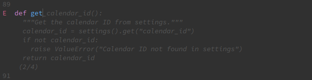
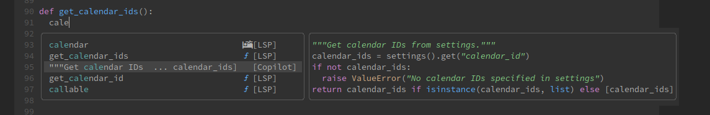

We are living in a transforming era for software development. Since the advent of LLMs (Large Language Models) being used as developer tools, starting around 2022 with OpenAI and GitHub Copilot, we have been presented with a growing number of alternatives that are both incredibly useful and disturbingly invasive for our daily workflows.

While on one side of the coin these new tools help us be more productive, on the other, the term _Vibe Coding_ started gaining some attention and preoccupying developers and managers that our skills might not be improving or even be diminishing since the adoption of such tools.

So the big question is how to leverage productivity using AI (Artificial Intelligence) while not becoming prisoners of these tools. 

We already have excellent articles about this topic, like [Avoiding Skill Atrophy in the Age of AI by Addy Osmani]. -- I intend here to extend that conversation a little further, by sharing my experience and providing some practical examples on how to use AI tools on a daily basis while not being overwhelmed, distracted, or dependent on it.

## But what is "Vibe Coding"?

>  Vibe coding (or vibecoding) is an approach to producing software by depending on artificial intelligence (AI), where a person describes a problem in a few sentences as a prompt to a large language model (LLM) tuned for coding. The LLM generates software based on the description, shifting the programmer's role from manual coding to guiding, testing, and refining the AI-generated source code.[1][2][3] 
>
> -- [Vibe Coding @ Wikipedia]

The term was first introduced by [Andrej Karpathy in his tweet][Vibe Coding by Andrej Karpathy @ X] and refers to the possibility, thanks to LLMs and recent AI tools, to create computer programs without actually typing any code. For this reason, _Vibe Coding_ allows even for non-developers to write software.

It does, however, bring up new concerns, as mentioned above, and even more, like distanciating the gap between a beginner and an experienced developer.

## Using AI for software development

Getting back on track, let me show you some tips and tricks on how to improve your coding with the use of AI, without letting it get in the way of thinking and logical planning that you are used to. The goal is to allow adding these tools to your existing workflow while not replacing it.

The following tips are a mix of practices and configurations that, despite the examples, should be applicable to whatever your choice of AI tools is.

### My toolset

As I mentioned, there are already plenty of tools to use AI and I don't have time or resources to try all of them. So I'm limiting the examples to the ones I use for Neovim or Terminal, and include some parallel examples for VS Code when possible. This should be enough to adapt the same ideas to other tools.

My entire AI toolset at the time of writing this post is composed by:

- [Copilot.lua]
- [CodeCompanion.nvim]
- [Copilot CLI]
- [Aider]

BTW, GitHub Copilot is a great option for those who want to start using AI developer tools and don't want to dig into all the options or spend money in several licenses. Copilot is especially good because it allows you to select other models without extra costs -- We will see how to do that later in this post.

### Learn how AI and LLM work

Although not necessary, learning the technology behind AI and LLMs helps to understand how they produce their responses, and how to make better use of contexts and prompts to reach the best results.

Remember that LLMs can't reason about the best way to solve a task, they just output text responses based on statistics and probabilities. They are built to be generalists, producing responses that are closest to correct as possible, which can be pretty far if the LLM haven't had he proper training for that task -- we call these incorrect responses _hallucinations_.

The blog post [Intro to Artificial Intelligence by Beatriz Amante @ The Miners] is a good start, showing the concepts behind AI in general.

Another good introduction source is the [Neural Networks playlist from 3Blue1Brown @ Youtube].


### Try different models

There are several different AI models today, created from different companies or groups, and each one has its own particularities.

Whenever you're not satisfied with an AI response or suggestion, it is a good idea to use a different model and try again. This can be easily done with GitHub Copilot Chat.

When using [CodeCompanion.nvim], on the chat window type `ga` to show a selection of adapters (the connection config to an LLM) and models to choose from. The selected adapter and model will be used by the next chat questions.


In the example above I'm using Copilot Adapter, which allows to select between the models GitHub Copilot has available.

In VS Code, click on the model name on the Chat window to select a different one.


### Avoid unwanted suggestions

The default Copilot usage while editing code is to suggest the next pieces of code during type as _ghost text_, allowing to accept with a keybinding (usually `Tab`) or ignore by continue typing.



This speeds up writing code at the cost of leaving fewer decisions for the developer, and maybe requiring extra effort to review, understand, and test the generated code.

I personally feel this feature extremely distracting, especially when pair programming with someone. So what I do is:

- Disable the auto suggestion in Copilot.lua
- Add copilot as a completion source using [copilot-cmp]

With this setting, Copilot never suggest code unless requested (typing `Ctrl+Space` in my case). The result is less distracting or intrusive, allowing me to focus on the code I'm typing, and use Copilot only when I really want to.

One great advantage of this configuration is that is places copilot suggestions side-by-side with other completion options, such as LSP or Snippets, which in most cases are just what I need -- like finding a correct method name, and not a full line or block of implementation.

Here is my config (using [Lazy.nvim]) and the result.

```lua
-- Copilot configuration
{
  "zbirenbaum/copilot.lua",
  dependencies = {
    "zbirenbaum/copilot-cmp",
  },

  opts = {
    suggestion = {
      enabled = true,       -- set to false to completely disable suggestions
      auto_trigger = false, -- or simply disable the auto trigger
    },
  },

  event = {
    'InsertEnter',
  },

  config = function(_, opts)
    require('copilot').setup(opts)

    -- Use Copilot as a cmp source
    require('copilot_cmp').setup()
  end,
}
```

```lua
-- Cmp / Completion configuration
{
  'hrsh7th/nvim-cmp',
  lazy = false,
  dependencies = {
    'zbirenbaum/copilot-cmp',
    -- ...other dependencies
  },

  config = function()
    -- Set up nvim-cmp.
    local cmp = require('cmp')

    cmp.setup({
      completion = {
        autocomplete = false, -- show completion options only when requested
      },

      sources = cmp.config.sources({
        -- ...other sources, lsp, snippets, etc
        { name = 'copilot' }, -- set copilot source
      }, {
        -- fallback sources
        { name = 'copilot' }, -- set copilot source
        { name = 'buffer' },
      }),
    })
  end,
}
```



To disable auto suggestions in VS Code, edit your `settings.json` and include the following.

```json
{
    "editor.inlineSuggest.enabled": false
}
```

Now Copilot Suggestions will only show when typing `Alt+\`.

### Customize and improve the System Prompt

Every AI Chat tool have ways to change or add to the System Prompt being used, which is usually a text or markdown file with a role and a set of instructions.

By changing or improving the system prompt we can customize the responses being generated, provide extra context, and define specific rules for the AI to follow.

CodeCompanion.nvim [System Prompt][Configuring the System Prompt @ CodeCompanion.nvim docs] is primarily based on the GitHub Copilot Chat's prompt but with some modifications. If can be replaced by using the following settings.

```lua
{
  opts = {
    system_prompt = function(opts)
      return "My new system prompt"
    end,
  },
}
```

I have been using the original one, with a few additions:

```txt
You must:
- Always provide links to official source documentation when explaining something. Ensure the links are accurate and relevant.

When suggesting next steps:
- suggest the use of the following to follow up with changes or requests, according to the needs
- `#lsp` to include language server information and code in the context
- `#buffer` to include the current buffer in the context
- `/buffer` to include other open buffers in the context
- `@editor` to follow with changes in the current buffer
- `@full_stack_dev` to follow with changes on the filesystem
```

VS Code doesn't allow to change system prompt directly, but you can use [instructions files][Customize chat responses in VS Code], which are placed under `.github/copilot-instructions.md` or `.github/instructions` to include additional rules.

Improving the system prompt is always a work in progress. I recommend you revisit yours from time to time to add, update, or remove some instructions.

### Create samples for AI to follow

Everything is about _context_ with AI. If you provide too few context the responses will unlikely be satisfactory, but if provide too much it may take a long time to complete a task and/or easily reach your token limit. It might not be very effect creating large chinks of code either, since those might take an enormous amount of time to review and, probably, fix.

For those reasons I found that it is much helpful to provide samples for AI to follow.

If you're writing tests for a new function. Write the first one and let the AI create its variations.

If you're creating several pure objects to represent a domain, create one or two and ask the AI to complete the collection.

If you're writing long lists or enums or constants, ask the AI to fill the missing ones.

By creating examples you make sure the code being written will follow your style and standards, you keep precticing and learning, while letting the AI do the repetitive work.

### Prefer to use specialized non-AI tools whenever possible

AI tools can excel in many things, but they are still worse than most specialized tools for certain tasks. Some strong examples are LSP (Language Server Protocol) for code completion or inspection, and linters for formatting or finding errors.

When bootstrapping a new project, start with the standard generators for the framework or language to use. Rails have an entire generator tooling to make easier creating new classes. Node `npx` can initialize virtually any project with its `create-*` packages.

When you see an error in your code, read the stack trace, inspect it line by line using breakpoints, debug the contents of variables. Every programming language have specialized tools to help with these tasks, such as Ruby `pry`, Javascript `debugger`, Rust `dbg!` macro, `gdb`, or `lldb`, just to mention some.

When in need or a simple http server, json parser, or search utility, use `python -m http.server`, `jq`, `ripgrep`, or any other tool you are used too.

All these tools are stable, tested, well maintained, reliable, and precitable. There is no need to use AI to solve problems that have already been solved in other ways.

### Don't neglect conventional sources or information

And finally, don't replace conventional sources of information or study by AI responses. You will still learn more by reading documentation or even asking in [StackOverflow] (yes, it is still a thing!) or GitHub Issues.

Remember, the official documentation of whatever language/framework/service/api you are using is always the source of truth and should be primary place to look. Searching the internet, especially in community sites, are a good second choice. Asking AI should be at least a third option.

That is not only about learning and improving your skills, but about finding the best answer or solution to write stable and reliable code.

## References

- [A Comprehensive Guide to Vibe Coding Tools](https://madhukarkumar.medium.com/a-comprehensive-guide-to-vibe-coding-tools-2bd35e2d7b4f)
- [Avoiding Skill Atrophy in the Age of AI by Addy Osmani]
- [Changing the AI model for Copilot Chat](https://docs.github.com/en/copilot/using-github-copilot/ai-models/changing-the-ai-model-for-copilot-chat)
- [Changing the AI model for Copilot code completion](https://docs.github.com/en/copilot/using-github-copilot/ai-models/changing-the-ai-model-for-copilot-code-completion?tool=vscode)
- [Coding with GitHub Copilot by Lycas Silve @ The Miners](https://blog.codeminer42.com/coding-with-github-copilot/)
- [Intro to Artificial Intelligence by Beatriz Amante @ The Miners]
- [My dotfiles](https://github.com/paulodiovani/dotfiles)
- [Timeline of artificial intelligence @ Wikipedia](https://en.wikipedia.org/wiki/Timeline_of_artificial_intelligence)
- [Vibe Coding @ Wikipedia](https://en.wikipedia.org/wiki/Vibe_coding)
- [Vibe Coding by Andrej Karpathy @ X](https://x.com/karpathy/status/1886192184808149383)
- [Configuring the System Prompt @ CodeCompanion.nvim docs]
- [Customize chat responses in VS Code]

[Aider]: https://github.com/paul-gauthier/aider
[Avoiding Skill Atrophy in the Age of AI by Addy Osmani]: https://addyo.substack.com/p/avoiding-skill-atrophy-in-the-age
[Claude Code]: https://docs.anthropic.com/en/docs/claude-code/overview
[CodeCompanion.nvim]: https://github.com/olimorris/codecompanion.nvim
[Copilot CLI]: https://docs.github.com/en/copilot/using-github-copilot/using-github-copilot-in-the-command-line
[Copilot Chat]: https://github.com/CopilotC-Nvim/CopilotChat.nvim
[Copilot.lua]: https://github.com/zbirenbaum/copilot.lua
[Intro to Artificial Intelligence by Beatriz Amante @ The Miners]: https://blog.codeminer42.com/intro-to-artificial-intelligence/
[Lazy.nvim]: https://lazy.folke.io/
[copilot-cmp]: https://github.com/zbirenbaum/copilot-cmp
[Configuring the System Prompt @ CodeCompanion.nvim docs]: https://codecompanion.olimorris.dev/configuration/system-prompt.html#configuring-the-system-prompt
[Customize chat responses in VS Code]: https://code.visualstudio.com/docs/copilot/copilot-customization#_instruction-files
[StackOverflow]: https://stackoverflow.com/
